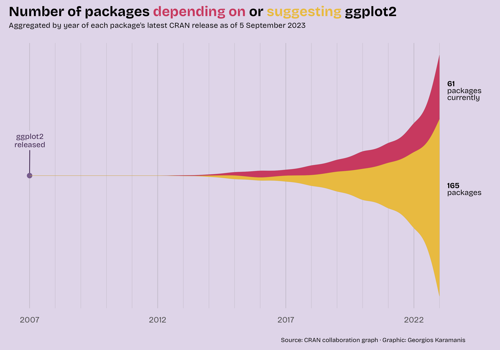

# Geoms {#sec-geoms}

```{r}
#| echo: false
#| message: false
#| results: asis
source("warning.R")
```

```{r}
#| echo: false
#| message: false
#| warning: false

library(conflicted)
conflicts_prefer(dplyr::filter)
conflicts_prefer(ggplot2::annotate)
```

A **geom** (short for geometric object) is a component that defines how data is visually represented in a plot. Geoms determine the type of visualization or the graphical shape that will be drawn.

"These geoms are the fundamental building blocks of **ggplot2** [@wickham2024a]. They are useful in their own right, but are also used to construct more complex geoms. Most of these geoms are associated with a named \[chart\]: when that geom is used by itself in a \[chart\], that \[chart\] has a special name." [@wickham2016]

ggplot2 already has a [long list of geoms](https://ggplot2.tidyverse.org/reference/index.html#geoms). We won't be discussing those unless there is an extension package that is an improvement to the original. Primarily, this chapter focuses on the geoms that ggplot2 does not include.

## Area charts {#sec-area-charts}

Area charts are based on line charts. The area between the x-axis and each line (or the area between lines) is shaded to help highlight the volume of the data.

In this section, we'll take a look at the **horizon chart**, an improved version of the **ribbon chart**, and the **streamgraph**. They are all different takes on the area chart.

### Horizon chart {#sec-horizon-chart}

A horizon chart is a method for condensing time series data into a format that is both informative and relatively easy to interpret.

Often, when you have both positive and negative values, they lie on both sides of the x-axis. In a horizon chart, the negative values are on the same side as the positive ones.

We use color to show whether the values are positive or negative. But also for the magnitude of those values.

As Jonathan Schwabish points out in their book, Better Data Visualizations [@schwabish2021], "the purpose of the horizon chart is not necessarily to enable readers to pick out specific values, but instead to easily spot general trends and identify extreme values".

#### Viz #1: Helsinki temperatures, part I {#sec-viz-1-helsinki-temperatures-part-i}

For the horizon chart, we'll be using **ggHoriPlot** [@rivas-gonzalez2022]. The package includes various example data sets. But we'll be using weather data from the **Finnish Meteorological Institute** (FMI). Its open data, weather observations are licensed under [CC BY 4.0](https://creativecommons.org/licenses/by/4.0/).

```{r}
#| echo:    false
#| message: false
#| warning: false
#| results: asis

library(readr)

temperature_hki <- read_csv("data/temperature-hki-2025-06-13.csv")
```

Using the [FMI API](https://en.ilmatieteenlaitos.fi/open-data) (Application Programming Interface), I retrieved the average temperatures in **Helsinki** (Kaisaniemi weather station) for the years 2000-2024. You can take a look at the data below.

```{r}
#| echo:    false
#| message: false
#| warning: false
#| results: asis

library(dplyr)
library(rmarkdown)

temperature_hki %>%
  paged_table()
```

We have **avg_temperature_celsius** (daily average temperature (in Celsius)), **day**, **month**, and **year**. We also have the **date_dummy** column. It is there because we want to use the month as the x-axis. But the column needs to be in *date* format for our use case. So we need all the rows to have the same dummy year with real months and days. I chose 2024 because it was a leap year. Without it, all the rows with February 29th would have *NA* in that column instead of the correct values.

Before we can proceed with the visualization, we need to perform some data wrangling. First, we’ll remove outliers using the [interquartile range (IQR) method](https://en.wikipedia.org/wiki/Interquartile_range).

```{r}
#| message: false
#| warning: false
#| results: asis

library(dplyr)

# Filter temperature data to exclude outliers based on 1.5 * IQR method
cutpoints <- temperature_hki %>%
  filter(
    between(
      avg_temperature_celsius,
      quantile(
        avg_temperature_celsius, 0.25, na.rm = TRUE
      ) - 1.5 * IQR(avg_temperature_celsius, na.rm = TRUE),
      quantile(
        avg_temperature_celsius, 0.75, na.rm = TRUE
      ) + 1.5 * IQR(avg_temperature_celsius, na.rm = TRUE)
    )
  )
```

```{r}
#| echo:    false
#| message: false
#| warning: false
#| results: asis

cutpoints %>%
  paged_table()
```

Fifteen outliers were filtered out, and we can continue. Next, we’ll calculate the midpoint of the temperature range and also divide the **scale** into evenly spaced value ranges. We’ll use the first as the **origin** for the horizon chart and the second to determine how to color the areas.

```{r}
#| message: false
#| warning: false
#| results: asis

# Calculate the midpoint of the temperature range for use in horizon chart
origin <- cutpoints %>%
  summarize(origin = mean(range(avg_temperature_celsius))) %>% 
  pull(origin)

# Create the scale vector:
# 7 evenly spaced values across the filtered temperature range.
# Drop the 4th value (the midpoint), as required by gghoriplot scale input
scale <- cutpoints %>%
  summarize(
    min_val = min(avg_temperature_celsius),
    max_val = max(avg_temperature_celsius)
  ) %>%
  # Generate 7 evenly spaced values
  with(seq(min_val, max_val, length.out = 7)) %>% 
  # Convert to tibble to use dplyr::slice()
  tibble() %>%
  # Remove the middle value (4th out of 7)
  slice(-4) %>% 
  # Return as plain numeric vector
  pull(.)
```

```{r}
#| echo:    false
#| message: false
#| warning: false

# The origin
.origin <- round(origin, 2)

# The horizon scale cutpoints
.scale <- round(scale, 2)
```

The origin is `r .origin`, and the scale cutpoints are as follows: `r .scale`.

Now we’re ready for the visualization itself. Besides ggHoriPlot and ggplot2, we’ll be using **ggthemes** [@arnold2024] to provide us the theme. We'll dive deeper into *themes* (including ggthemes in @sec-ggthemes) later on in @sec-themes.

We're using `geom_horizon()` to create the horizon chart. The arguments to pay attention to are **fill** (inside `aes()`), **origin**, and **horizonscale**. They are all using the origin and scale we calculated earlier. `scale_fill_hcl()` is also available in the ggHoriPlot package. Otherwise, we’re using basic ggplot2 functionalities.

```{r}
#| code-fold: true
#| code-summary: "Show the code"
#| message: false
#| warning: false
#| results: asis

library(ggHoriPlot) # for geom_horizon() to create horizon plots
library(ggplot2)    # for general plotting functions
library(ggthemes)   # for additional themes like theme_few()

# Create the horizon chart
ggplot(temperature_hki) +
  
  # Horizon chart layer, mapping x, y, and fill aesthetics
  geom_horizon(
    aes(
      date_dummy,              # x-axis: typically date
      avg_temperature_celsius, # y-axis: temperature variable
      fill = ..Cutpoints..     # fill determined by horizon chart cutpoints
    ), 
    origin       = origin, # baseline (e.g., 0°C); defines neutral midpoint
    horizonscale = scale   # vertical scale; controls how bands are split
  ) +
  
  # Use a diverging color scale (red-blue), reversed so red = high temp
  scale_fill_hcl(palette = "RdBu", reverse = TRUE) +
  
  # Create one small horizon chart per year, stacked vertically
  facet_grid(vars(year)) +
  
  # Use a clean, simple theme based on the rules and examples from Stephen
  # Few's Show Me the Numbers and Practical Rules for Using Color in Charts
  theme_few() +
  
  # Customize appearance
  theme(
    # Customize x-axis labels
    axis.text.x     = element_text(size = 10),
    # Remove unnecessary labels
    axis.text.y     = element_blank(),                   
    axis.title.y    = element_blank(),                   
    axis.ticks.y    = element_blank(),                   
    panel.border    = element_blank(),                   
    # Remove vertical space between facets
    panel.spacing.y = unit(0, "lines"),                  
    # Subtle caption style
    plot.caption    = element_text(size = 8, hjust = 0, color = "#777777"),
    # Adjust margins because otherwise Jan is too close to the left edge
    plot.margin     = margin(10, 10, 10, 15),             
    # Customize facet labels
    strip.text.y    = element_text(size = 8, angle = 0, hjust = 0)  
  ) +
  
  # Format x-axis to show months (with short names) without expansion
  scale_x_date(
    expand      = c(0, 0),
    date_breaks = "1 month", 
    date_labels = "%b"
  ) +
  
  # Add informative plot title, subtitle, and data source caption
  labs(
    title    = "Average daily temperature (°C) in Helsinki",
    subtitle = "From 2000 to 2024",
    caption  = "Data: Finnish Meteorological Institute open data, weather observations (CC BY 4.0) | Visualization: Antti Rask",
    x        = NULL # remove x-axis title
  )
```

I'm not a climatologist, but it does seem like there is a trend, over time, of Helsinki having milder winters. The summer temperatures are less clear-cut and will need a closer look.

### Ribbon chart (improved) {#sec-ribbon-chart-improved}

As the ggplot2 documentation tells us, an area chart is, in fact, a special case of a ribbon chart. That makes sense when you realize that every type of area chart has a **ymin** and **ymax**. In the basic area chart, ymin is zero, and ymax is **y**. [@wickham2024a]

The ribbon chart, then, displays the area between two lines. `geom_ribbon()` gets the job done when the lines don’t meet. But as you’ll soon see, for those cases where they do, you need something called *braiding*. You can read more about it in the **ggbraid** [@grantham2025] [documentation](https://nsgrantham.github.io/ggbraid/articles/temps.html#the-unbraided-ribbon-problem).

#### Viz #2: IMDb movies, Part I {#sec-viz-2-imdb-movies-part-i}

We’ll take a look at what the problem (and solution) looks like with real data. The question we'd like to answer here is which genre, comedy or drama, has produced more movies during the 20th century.

But let’s first examine the data we’ll be using for this. Time series data works best for this type of chart. Let’s stick to the **ggplot2movies** [@wickham2015] data set that we first encountered in @sec-imdb-movies-1893-2005 and the **movies_na** tibble.

```{r}
#| message: false
#| warning: false
#| echo:    false

library(dplyr)
library(rmarkdown)
library(ggplot2movies)

movies_na <- movies %>%
  mutate(
    # Turn all blank values of the character type into NA
    across(where(is.character), ~na_if(., "")), 
    # Create a decade column for grouping based on the values in the year column
    decade = floor(year / 10) * 10
  )
```

We’ll perform some transformations to prepare the data for visualization. In this case, we’ll need the data in two *formats*, **long** and **short**.

Let's first create the *long* tibble consisting of **genre**, **year**, and **n** (for the count).

One minor detail to note here is that we’ll turn the genre column from *character* to *factor* format. We’ll use **forcats** [@wickham2023h] from **tidyverse** [@wickham2023b] to do that. It's not necessary in this case, but it's good practice.

```{r}
#| message: false
#| warning: false

library(forcats)
library(tidyr)

# Transform and filter the `movies_na` data set
movies_na_long <- movies_na %>%
  
  # Pivot genre columns (from Action to Short) into long format:
  # Creates two columns: "genre" and "value"
  pivot_longer(Action:Short, names_to = "genre") %>%
  
  # Filter to keep only:
  # - rows where the movie is flagged in that genre (value != 0)
  # - only the genres Comedy and Drama
  # - movies released between 1900 and 2000
  filter(
    value != 0,
    genre %in% c("Comedy", "Drama"),
    between(year, 1900, 2000)
  ) %>%
  
  # Convert genre to a factor
  mutate(genre = as_factor(genre)) %>%
  
  # Count the number of movies per genre per year
  count(genre, year)
```

```{r}
#| echo:    false
#| message: false
#| warning: false
#| results: asis

movies_na_long %>% 
  paged_table()
```

Next, we’ll split the genre into two separate columns, Comedy and Drama. They will retrieve their values from the n column.

We’ll also be adding a **fill_condition** column. We’ll use that later to determine which color to use to fill the area between the two lines.

```{r}
#| message: false
#| warning: false

# Convert long-format genre counts back to wide format and compare values
movies_na_wide <- movies_na_long %>%
  
  # Pivot genre counts from long to wide:
  # Each genre becomes its own column (e.g., Comedy, Drama),
  # with yearly counts as values
  pivot_wider(
    names_from  = genre,
    values_from = n
  ) %>%
  
  # Create a new logical column indicating whether
  # Comedy had fewer movies than Drama in that year
  mutate(fill_condition = Comedy < Drama)
```

```{r}
#| echo:    false
#| message: false
#| warning: false
#| results: asis

movies_na_wide %>% 
  paged_table()
```

Now we can return to the topic of why we need to use an extension for cases where the lines don’t stay separate.

Here’s what the basic visualization would look like with `geom_ribbon()` from ggplot2.

```{r}
#| message: false
#| warning: false

library(ggplot2)

ggplot() +
  geom_line(
    aes(year, n, linetype = genre),
    data = movies_na_long
  ) +
  geom_ribbon(
    aes(year, ymin = Comedy, ymax = Drama, fill = fill_condition),
    data  = movies_na_wide,
    alpha = 0.7
  )
```

That won't work if we want to use the ribbon chart to show where the two categories change places, indicating which is greater.

But that's where ggbraid's `geom_braid()` comes to the rescue. The basic code is the same. We'll only switch the geom function.

The rest of the code is to make the visualization more presentable. Note that we'll move the legend inside the plot. We'll use the **legend.position** argument inside the `theme()` function to do that. There's enough *white space* inside the plot to accommodate the legend. This way, we gain more space to showcase the time series element of the plot.

```{r}
#| code-fold: true
#| code-summary: "Show the code"
#| message: false
#| warning: false

library(ggbraid) # for geom_braid() to visualize overlapping time series
library(ggplot2) # for general plotting functions

ggplot() +
  
  # Line plot for number of movies per genre per year
  geom_line(
    aes(year, n, linetype = genre),
    data = movies_na_long
  ) +
  
  # Braid layer to highlight which genre had more movies per year
  geom_braid(
    aes(year, ymin = Comedy, ymax = Drama, fill = fill_condition),
    data  = movies_na_wide,
    alpha = 0.7
  ) +
  
  # Text annotation when comedies dominated
  annotate(
    "text",
    x     = 1938,
    y     = 300,
    size  = 4,
    label = "More comedies than drama",
    hjust = 0.5,
    color = "#F36523"
  ) +
  
  # Text annotation when dramas dominated
  annotate(
    "text",
    x     = 1975,
    y     = 80,
    size  = 4,
    label = "More drama than comedies",
    hjust = 0.5,
    color = "#125184"
  ) +
  
  # Manually set fill colors for the braid based on fill condition
  scale_fill_manual(values = c("#F36523", "#125184")) +
  
  # Customize x-axis: limit, spacing, and ticks
  scale_x_continuous(
    expand = c(0, 1),
    limits = c(1899, 2001),
    breaks = seq(1900, 2000, by = 10)
  ) +
  
  # Customize y-axis: limit, spacing, and ticks
  scale_y_continuous(
    expand = c(0, 1),
    limits = c(0, 800),
    breaks = seq(0, 800, by = 100)
  ) +
  
  # Hide fill legend (keep linetype legend only)
  guides(fill = "none") +
  
  # Add plot title, subtitle, and axis labels
  labs(
    linetype = NULL,
    title    = "100 years of cinema",
    subtitle = "Number of comedies vs. dramas throughout the 20th century",
    caption  = "Data: IMDb movies (1893-2005) via {ggplot2movies} | Visualization: Antti Rask",
    x        = NULL,
    y        = NULL
  ) +
  
  # Use a clean black-and-white theme as a base
  theme_bw() +
  
  # Custom legend appearance and positioning
  theme(
    legend.direction = "horizontal",
    legend.box.background = element_rect(
      color     = "black",
      linetype  = "solid",
      linewidth = 0.5
    ),
    legend.key.size  = unit(2, "line"),
    legend.position  = c(0.19, 0.88), # relative position inside plot
    legend.text      = element_text(size = 10)
  )
```

I'm not an expert on this topic either. Based on this data set, however, there appears to be a correlation between major wars (WWI, WWII, and the Vietnam War) and the production of more comedies than dramas.

#### Viz #3: Helsinki temperatures, part II {#sec-viz-3-helsinki-temperatures-part-ii}

Let's take a look at another ribbon chart. We can use the data set from @sec-horizon-chart, which contains average daily temperatures in Helsinki from 2000 to 2024. We'll compare the two years, 2000 and 2024. Which one had more warmer days?

First, we’ll perform similar transformations as before and convert the data into both long and wide formats.

One minor detail to note here is that we’ll need to turn the year column from *numeric* to *factor* format. It won’t work as a category for the **linetype** argument otherwise. We’ll again use the forcats package to do that.

```{r}
#| message: false
#| warning: false

temperature_hki_long <- temperature_hki %>%
  
  # Filter data to include only the years 2000 and 2024
  filter(year %in% c(2000, 2024)) %>%
  
  # Convert `year` to a factor (useful for plotting or grouping)
  mutate(year = as_factor(year)) %>%
  
  # Keep only the necessary columns for analysis or visualization
  select(avg_temperature_celsius, year, date_dummy)
```

In this next transformation, note the use of the **names_prefix** argument. A column with a number as the first character of the name is not ideal. This will take care of that.

```{r}
#| message: false
#| warning: false

# Pivot data from long to wide format
temperature_hki_wide <- temperature_hki_long %>%
  
  # Creates one column per year (e.g., year_2000, year_2024),
  # using temperature values as the content
  pivot_wider(
    names_from   = year,
    names_prefix = "year_",
    values_from  = avg_temperature_celsius
  ) %>%
  
  # Create a new logical column to compare the two years:
  # TRUE if 2024 temp > 2000 temp for that date
  mutate(fill_condition = year_2000 < year_2024)
```

We’ll also count the number (and percentage of total) of days where the average temperature is greater in 2000 and 2024. We’ll use this information for annotations.

```{r}
#| message: false
#| warning: false

temperature_hki_wide %>%
  
  # Count how many days had each condition (TRUE/FALSE)
  count(fill_condition) %>%
  
  # Calculate the percentage for each group
  mutate(n_pct = round(n / sum(n), 3))
```

Looks like 2024 has more days (60.4%) that were, on average, warmer than 2000 (39.6%).

The visualization itself is like the movie example. The most significant difference is the use of two packages from the tidyverse family.

`str_glue()` from **stringr** [@wickham2023g] features a convenient implicit line break functionality. We’ll also use it to add the degree Celsius symbol (°C) to the y-axis.

`as_date()` from **lubridate** [@spinu2024] allows us to use the date in *character* format to map it to the x-axis. This helps us place the annotations in the correct position.

```{r}
#| code-fold: true
#| code-summary: "Show the code"
#| message: false
#| warning: false

library(ggbraid)   # for geom_braid(), visualizing area between two lines
library(ggplot2)   # for general plotting functions
library(lubridate) # for working with date types
library(stringr)   # for string manipulation like str_glue()

ggplot() +
  
  # Add temperature lines for each year (2000 and 2024)
  geom_line(
    aes(date_dummy, avg_temperature_celsius, linetype = year),
    data = temperature_hki_long
  ) +
  
  # Add braided area showing difference between 2000 and 2024
  # Fill based on which year was warmer (fill_condition)
  geom_braid(
    aes(
      date_dummy,
      ymin = year_2000,
      ymax = year_2024,
      fill = fill_condition
    ),
    data  = temperature_hki_wide,
    alpha = 0.7
  ) +
  
  # Annotate area where 2000 was warmer
  annotate(
    "text",
    x     = as_date("2024-03-01"),
    y     = -17.5,
    size  = 4,
    label = str_glue(
      "2000 was warmer
      40 % of the days"
    ),
    hjust = 0.5,
    color = "#125184"
  ) +
  
  # Annotate area where 2024 was warmer
  annotate(
    "text",
    x     = as_date("2024-11-15"),
    y     = 17.5,
    size  = 4,
    label = str_glue(
      "2024 was warmer 
      60 % of the days"
    ),
    hjust = 0.5,
    color = "#F36523"
  ) +
  
  # Manual fill colors: blue for 2000 warmer, orange for 2024 warmer
  scale_fill_manual(values = c("#125184", "#F36523")) +
  
  # Format x-axis: monthly ticks, short month labels
  scale_x_date(
    date_breaks = "1 month",
    date_labels = "%b",
    expand      = c(0, 0.1)
  ) +
  
  # Format y-axis: show temperature with °C symbol
  scale_y_continuous(labels = ~ str_glue("{.x} °C")) +
  
  # Hide fill legend (keep linetype legend only)
  guides(fill = "none") +
  
  # Add plot title, subtitle, and caption
  labs(
    linetype = NULL,
    title    = "Is the temperature rising?",
    subtitle = "Average daily temperatures (Celsius) in Helsinki, 2000 vs. 2024",
    caption  = "Data: Finnish Meteorological Institute open data, weather observations (CC BY 4.0) | Visualization: Antti Rask",
    x        = NULL,
    y        = NULL
  ) +
  
  # Use a clean, minimal black-and-white theme
  theme_bw() +
  
  # Customize legend and caption styling
  theme(
    legend.direction = "horizontal",
    legend.box.background = element_rect(
      color     = "black",
      linetype  = "solid",
      linewidth = 0.5
    ),
    legend.key.size  = unit(2, "line"),
    legend.position  = c(0.83, 0.12), # bottom-right position
    legend.text      = element_text(size = 10),
    plot.caption     = element_text(size = 8, hjust = 1, color = "#777777")
  )
```

And so we have another perspective on the Helsinki temperature data set.

### Streamgraph {#sec-streamgraph}

A streamgraph is a stacked area chart where the areas are positioned around the central axis.

#### Viz #4: ggplot2 dependencies {#sec-viz-4-ggplot2-dependencies}

If you’ve read the book in chronological order, you’ve already encountered a streamgraph in @sec-landscape. We will use that visualization as the example in this section.

The purpose of this visualization is to illustrate how the ggplot2 dependencies have evolved from a small speck in 2007 to their current state at the end of 2025. This is the exact use case for which I would use a streamgraph.

Before we proceed, I want to mention **Georgios Karamanis**. Their [original visualization](https://github.com/gkaramanis/tidytuesday/tree/master/2023/2023-week_38) for [Tidy Tuesday](https://github.com/rfordatascience/tidytuesday) (see Figure 3.1) was the inspiration for my version.

{.lightbox}

If you want to know the differences, they are as follows:

1)  Use the initial release years instead of the latest release...
2)  ...which meant switching the data source
3)  Use the ggplot2-related packages' metadata
4)  Bring in a third type, **Imports**
5)  Change the color palette
6)  Change the fonts to **Roboto Mono**
7)  Annotate all the major ggplot2 releases
8)  Make the stream chart less wavy
9)  Other, smaller changes

We'll cover these in more detail as we proceed.

```{r}
#| echo:    false
#| message: false
#| warning: false
#| results: asis

ggplot2_dependencies_by_year <- read_csv("data/ggplot2-dependencies-by-year-2025-12-31.csv")
```

Let's take a look at the data we're working with. It was gathered with **pkgsearch** [@csardi2025].

```{r}
#| echo:    false
#| message: false
#| warning: false
#| results: asis

ggplot2_dependencies_by_year %>%
  paged_table()
```

We won’t reiterate the definitions of the different **types** (see @sec-landscape for them). But we can see that the *count* for each type starts small in 2007 and increases significantly by 2025.

Let’s first take a look at what the streamgraph would look like with default settings. We'll use `geom_stream()` from **ggstream** [@sjoberg2021] for that.

```{r}
#| message: false
#| warning: false

library(ggstream)

ggplot2_dependencies_by_year %>%
  ggplot() +
  geom_stream(
    aes(
      x    = year,
      y    = n,
      fill = type
    )
  )
```

That's not bad for ten lines of code. But we can make it more presentable.

Let’s start with colors. In the previous visualizations, we’ve inserted the *hex codes* straight into the code. But since we need to use these colors in many places, let’s convert them into a vector so we don’t have to repeat ourselves.

```{r}
#| message: false
#| warning: false

color_1 <- "#F36523"
color_2 <- "#125184"
color_3 <- "#2E8B57"
colors_viz_4  <- c(color_1, color_2, color_3)

colors_viz_4
```

For the font, I wanted to use something different. Roboto is a slightly futuristic font (family) that I like. But it doesn't come with R.

That's why we'll use **showtext** [@qiu2024] (read more about it in @sec-showtext).

```{r}
#| message: false
#| warning: false

library(showtext)

font_add_google("Roboto Mono", "roboto")
showtext_auto()
font_family <- "roboto"
```

Next, we’ll create the annotations that'll be displayed on the right side of the graph.

The labels are in an HTML-style format. To be used later with **ggtext** [@wilke2022]. We’ll delve into this topic in more detail in @sec-ggtext.

```{r}
#| message: false
#| warning: false

annotation_numbers <- ggplot2_dependencies_by_year %>%
  
  # Total number of packages per dependency type
  summarize(
    n   = sum(n),
    .by = type
  ) %>%
  
  # Ensure consistent vertical stacking order
  arrange(type) %>%
  
  mutate(
    
    # Manually assign y-positions for labels
    y = c(440, 75, -350),
    
    # Create HTML-styled rich labels with colored numbers
    label = case_when(
      type == "Depends" ~
        str_glue("**<span style='color:{color_1}'>{n}</span>**"),
      type == "Imports" ~
        str_glue("**<span style='color:{color_2}'>{n}</span>**"),
      type == "Suggests" ~
        str_glue("**<span style='color:{color_3}'>{n}</span>**")
    )
  )
```

```{r}
#| echo:    false
#| message: false
#| warning: false
#| results: asis

annotation_numbers %>% 
  paged_table()
```

Now it’s time to bring it all together.

Usually, you would start with the main geom for the plot. But we must begin with the data points and labels due to the layer order. We’re stacking layers on top of each other, and here we want the lines for the labels to stay behind the streamgraph.

The new packages we haven't mentioned before are **colorspace** [@ihaka2024] and **ggrepel** [@slowikowski2024].

We get back to them both in detail later, but colorspace (see more in @sec-colorspace)) is used for color manipulation. In this graph, we're making the borders of the areas slightly darker than the areas themselves. ggrepel (see more in @sec-repel-overlapping-labels-and-text) is used for creating labels that don't overlap.

```{r}
#| code-fold: true
#| code-summary: "Show the code"
#| message: false
#| warning: false

library(colorspace) # for color manipulation like darken()
library(ggplot2)    # for general plotting functions
library(ggrepel)    # for placing non-overlapping labels
library(ggstream)   # for creating streamgraphs
library(ggtext)     # for text manipulation
library(stringr)    # for string manipulation like str_glue()

ggplot(ggplot2_dependencies_by_year) +
  
  # Add a small point at the origin to anchor the first version label
  geom_point(
    aes(x = 2007, y = 0),
    data = tibble(),
    size = 1.5
  ) +
  
  # Add a label for ggplot2 version 0.5 (2007)
  geom_label_repel(
    aes(x = 2007, y = 0, label = "{ggplot2}\nver 0.5"),
    data        = tibble(),
    nudge_y     = 75,
    linewidth   = 0,
    lineheight  = 0.9,
    family      = font_family
  ) +
  
  # Add a label for ggplot2 version 1.0 (2014)
  geom_label_repel(
    aes(x = 2014, y = 50, label = "{ggplot2}\nver 1.0"),
    data       = tibble(),
    nudge_y    = 115,
    linewidth  = 0,
    lineheight = 0.9,
    family     = font_family
  ) +
  
  # Add a label for ggplot2 version 2.0 (2015)
  geom_label_repel(
    aes(x = 2015, y = 125, label = "{ggplot2}\nver 2.0"),
    data       = tibble(),
    nudge_y    = 100,
    linewidth  = 0,
    lineheight = 0.9,
    family     = font_family
  ) +
  
  # Add a label for ggplot2 version 3.0 (2018)
  geom_label_repel(
    aes(x = 2018, y = 100, label = "{ggplot2}\nver 3.0"),
    data       = tibble(),
    nudge_y    = 200,
    linewidth  = 0,
    lineheight = 0.9,
    family     = font_family
  ) +
  
  # Add a label for ggplot2 version 4.0 (2025)
  geom_label_repel(
    aes(x = 2025, y = 450, label = "{ggplot2}\nver 4.0"),
    data       = tibble(),
    nudge_y    = 100,
    linewidth  = 0,
    lineheight = 0.9,
    family     = font_family
  ) +
  
  # Create a stream-like area chart showing the number of dependent 
  # packages by type and year
  geom_stream(
    aes(
      x     = year,
      y     = n,
      fill  = type,
      # Slightly darken stream borders for contrast
      color = after_scale(darken(fill))
    ),
    # bw means bandwidth of kernel density estimation
    # This is the argument you can control the waviness with
    # The closer the value is to 1, the less wavy the graph
    bw        = 1,
    linewidth = 0.1
  ) +
  
  # Add annotations on the right side using rich text labels from ggtext
  geom_richtext(
    aes(
      x     = 2025 + 0.2,
      y     = y,
      label = label
    ),
    data       = annotation_numbers,
    hjust      = 0,
    lineheight = 0.9,
    label.size = NA,
    size       = 5,
    family     = font_family
  ) +
  
  # Configure the x-axis with major and minor breaks
  scale_x_continuous(
    breaks       = seq(2007, 2025, 2),
    minor_breaks = 2007:2025
  ) +
  
  # Manually assign fill colors for the dependency types
  scale_fill_manual(values = colors_viz_4) +
  
  # Allow annotations to extend outside the plot area
  coord_cartesian(clip = "off") +
  
  # Set plot titles and descriptions using inline color styling
  labs(
    title = str_glue("Number of packages on CRAN in 2025 <span style='color:{color_1}'>depending on</span>, <span style='color:{color_2}'>importing</span>, or <span style='color:{color_3}'>suggesting</span> {{ggplot2}}"),
    subtitle = "Aggregated by the initial package release years. Categories may change from one version to another and were taken from the original versions.",
    caption  = "Data: CRAN via {pkgsearch} | Visualization: Antti Rask | Updated: 2025-12-31"
  ) +
  
  # Apply a clean, minimal theme and customize text styling
  theme_minimal(base_family = font_family) +
  
  # Customize title and caption styling
  theme(
    axis.text.x = element_text(
      size   = 14,
      face   = "bold",
      margin = margin(10, 0, 0, 0)
    ),
    axis.text.y           = element_blank(),
    axis.title            = element_blank(),
    legend.position       = "none",
    panel.grid.major.y    = element_blank(),
    panel.grid.minor.y    = element_blank(),
    plot.margin           = margin(10, 10, 10, 10),
    plot.title            = element_markdown(
      face  = "bold",
      size  = 20,
      hjust = 0.5
    ),
    plot.subtitle = element_text(
      hjust  = 0.5,
      margin = margin(0, 0, 20, 0)
    ),
    plot.caption = element_text(
      size   = 10,
      color  = darken("darkgrey", 0.4),
      hjust  = 0.5,
      margin = margin(20, 0, 0, 0)
    )
  )
```

Streamgraph, like other area graphs, isn’t the best for making detailed comparisons between groups. But it's excellent for creating a broader picture of what’s going on in the data.

There is also an interactive version of streamgraph, built in to the package. We'll check it out in @sec-interactive-streamgraph.

## Bar charts {#sec-bar-charts}

Bar charts are the backbone of data visualization. And ggplot2 handles most types of bar charts out of the box. However, there are situations where you may want to take it a step further.

In this section, we’ll take a look at the **Likert chart** and the **mosaic chart**, also known as the **Marimekko chart** or the **Mekko chart**, after the company (go Finland!).

### Likert chart {#sec-likert-chart}

A Likert chart is a diverging stacked bar chart. It’s used to visualize responses to a questionnaire using the Likert (or similar) scale format. The “respondents are asked to indicate their degree of agreement or disagreement on a symmetric agree-disagree scale for each of a series of statements” [@burns2007].

For Likert charts, **ggstats** [@larmarange2025a] is my package of choice. It also has other functionalities, which we’ll return to in @sec-ggstats.

#### Viz #5: PISA 2022 Questionnaire {#sec-viz-5-pisa-2022-questionnaire}

I was thinking of a good, open data source for the Likert chart. Most packages (ggstats included) use older **PISA** (Programme for International Student Assessment) questionnaires for the example data. I was able to find more recent data and selected seven statements from the PISA 2022 Student Questionnaire [@oecd2023]. There was a lot of data to choose from, but I selected the statements that a) dealt with creativity and b) had the fewest number of NAs in the answers.

```{r}
#| echo:    false
#| message: false
#| warning: false
#| results: asis

pisa_2022_labels     <- read_csv("data/pisa_2022_can_fin_gbr_7_labels.csv")
pisa_2022_statements <- read_csv("data/pisa_2022_can_fin_gbr_7_statements.csv")
```

I chose three countries to compare. Canada, Finland and Great Britain. I would've been interested in seeing a comparison between the US as well, but sadly the data was all NAs for these statements.

Let's first take a look at the data we have.

```{r}
#| echo:    false
#| message: false
#| warning: false
#| results: asis

pisa_2022_statements %>%
  paged_table()
```

There is a **country** column, but the other columns each have answers to one of the statements. They all have a technical ID as a name (e.g., **ST339Q04JA**) and these possible values:

-   Strongly disagree
-   Disagree
-   Agree
-   Strongly agree
-   NA

We can already take a look at what this data would look like visualized with one function, `gglikert()`. We don't want to include the country column yet.

```{r}
#| message: false
#| warning: false

library(ggstats)

pisa_2022_statements %>%
  gglikert(include = -country)
```

By default, `gglikert()` ignores the NA values. If we wanted to, we could turn them into a character string. And then use the **exclude_fill_values** argument to "\[count\] them in the denominator for computing proportions" [@larmarange2025a].

Now, two things are wrong with this first plot.

1.  We don't know what the statements were (unless we go and look elsewhere)
2.  The categories aren't in the correct order. The default order for the *character* type is alphabetical

First, let's look at the labels we have in a separate tibble.

```{r}
#| echo:    false
#| message: false
#| warning: false
#| results: asis

pisa_2022_labels %>%
  paged_table()
```

Let's turn them into a named vector that we can use. We'll use the `deframe()` function from **tibble** [@müller2023] for that.

```{r}
#| message: false
#| warning: false

library(tibble)

pisa_2022_labels_vector <- pisa_2022_labels %>%
  deframe()
```

```{r}
#| echo:    false
#| message: false
#| warning: false

pisa_2022_labels_vector
```

Then we'll create another vector for the agreement levels. Notice that they are now in the order we want them to be in.

```{r}
#| message: false
#| warning: false

agreement_levels <- c(
  "Strongly disagree",
  "Disagree",
  "Agree",
  "Strongly agree"
)
```

We’ll convert the statement columns in our data set into factors. And we’ll use the `fct_relevel()` function to reorder those factors in the desired order.

```{r}
#| message: false
#| warning: false

pisa_2022_statements_refactored <- pisa_2022_statements %>%
  mutate(
    across(
      -country,
      ~ as_factor(.) %>% fct_relevel(agreement_levels)
    )
  )
```

Let’s see what the plot looks like now after those two changes.

```{r}
#| message: false
#| warning: false

pisa_2022_statements_refactored %>%
  gglikert(
    include         = -country,
    variable_labels = pisa_2022_labels_vector
  )
```

Much better! Let's try adding the country as a grouping variable. We have two basic options for arguments, **facet_cols** and **facet_rows**. Let's first see what it would look like if we facet the plot with the countries as columns.

```{r}
#| message: false
#| warning: false

pisa_2022_statements %>%
  gglikert(
    include         = -country,
    facet_cols      = vars(country),
    variable_labels = pisa_2022_labels_vector
  )
```

That makes it quite hard to compare the values between the countries. Let's see what it would look like if we facet the plot with the countries as rows.

```{r}
#| message: false
#| warning: false

pisa_2022_statements %>%
  gglikert(
    include         = -country,
    facet_rows      = vars(country),
    variable_labels = pisa_2022_labels_vector
  )
```

That’s way too busy, and still, it’s hard to compare the countries. Luckily, we have a third option.

We can facet the rows using the statements as the upper level. And then use the countries as a lower level. This way, the plot is both readable and easier to compare between the countries.

The rest of the code is primarily used to make the visualization more presentable.

```{r}
#| code-fold: true
#| code-summary: "Show the code"
#| message: false
#| warning: false

library(ggplot2) # for general plotting functions
library(ggstats) # for Likert charts

# Create a Likert chart for PISA 2022 student statements, faceted by statement
gglikert(
  
  # Data
  pisa_2022_statements_refactored,
  
  # Include all columns except 'country'
  include = -country,
  
  # y-axis shows countries
  y = "country",
  
  # Use custom labels for statements
  variable_labels = pisa_2022_labels_vector,
  
  # Sort responses in descending order
  sort = "descending",
  
  # Facet rows by statement variable
  facet_rows = vars(.question)
) +
  
  # Adjust facet grid layout: wrap statement labels and move to the left side
  facet_grid(
    
    # Facet rows by statement variable
    rows     = vars(.question),
    
    # Switch facet labels to the left side
    switch   = "y",
    
    # Wrap long labels at 30 characters
    labeller = label_wrap_gen(30)
  ) +
  
  # Manually set Likert scale colors for each response level
  scale_fill_manual(
    values = c(
      "Strongly disagree" = "#ca0020",
      "Disagree"          = "#f4a582",
      "Agree"             = "#92c5de",
      "Strongly agree"    = "#0571b0"
    )
  ) +
  
  # Add title, subtitle, and caption to the plot
  labs(
    title    = "The majority of respondents in Canada, Finland, and Great Britain feel creative, even if they don't all express themselves through art",
    subtitle = "PISA 2022 Student Questionnaire - a sample of 7 statements",
    caption  = "Data: OECD | Visualization: Antti Rask"
  ) +
  
  # Apply custom theme styling for text, facets, and layout
  theme(
    text                  = element_text(family = "wqy-microhei"),
    axis.text             = element_text(color = "#333333"),
    strip.background.y    = element_rect(fill = "#FFD166"),
    strip.placement.y     = "top", # Place facet labels on top, or in this case, left
    strip.text.y.left     = element_text(angle = 0, hjust = 0.5, color = "#333333"),
    legend.margin         = margin(0, 0, 0, 0),
    plot.caption          = element_text(hjust = 0, color = "#333333"),
    plot.caption.position = "plot",
    plot.margin           = margin(10, 10, 10, 10),
    plot.title.position   = "plot"
  )
```

The kids seem to be alright! At least when it comes to feeling creative. There are some interesting differences between the three countries, but nothing too extreme.

### Mosaic chart {#sec-mosaic-chart}

A mosaic chart is a special type of stacked bar chart. It differs from a normal one in that “the heights and widths of individual shaded areas vary” [@wilke2019].

To create a mosaic chart, we’ll be using **marimekko** [@kałędkowski2026]. It provides `geom_marimekko()` as a native ggplot2 layer, so you can combine it with any other ggplot2 functionality (facets, themes, annotations, etc.).

**Note!** I wrote the first version of this chapter with **ggmosaic** [@jeppson2021] in mind. But it was archived from **CRAN** on 2025-11-10 (as issues remained uncorrected despite reminders). Even the version on GitHub isn't working currently. So I had to find a replacement. Marimekko is that package.

#### Viz #6: IMDb movies, Part II {#sec-viz-6-imdb-movies-part-ii}

We return to the IMDb movies data set. This time, looking at how many movies in each genre have a certain *MPAA rating* (among those movies that have a rating in the first place).

We’ll use the already familiar movies_na data set. But we’ll have to make some adjustments to get it ready for marimekko.

The new function here is `fct_infreq()`. It helps us order the factor levels by size, even though we don’t have a separate column for those counts.

```{r}
#| message: false
#| warning: false

# Transform and filter the `movies_na` data set
movies_marimekko <- movies_na %>%
  
  # Pivot genre columns (from Action to Short) into long format:
  # Creates two columns: "genre" and "value"
  pivot_longer(Action:Short, names_to = "genre") %>%
  
  # Filter to keep only:
  # - rows where the movie is flagged in that genre
  # - rows where the MPAA value is not NA
  filter(
    value != 0,
    !is.na(mpaa)
  ) %>%
  
  # Select only the MPAA and genre columns
  select(mpaa, genre) %>%
  
  # Convert both columns to a factor
  mutate(
    
    # For MPAA the levels and their order is clear
    mpaa = mpaa %>% factor(levels = c("PG", "PG-13", "R", "NC-17")),
    
    # For genre, we'll use fct_infreq to order the levels by number of 
    # observations with each level (largest first)
    genre = genre %>% as_factor() %>% fct_infreq(.)
    
  )
```

```{r}
#| echo:    false
#| message: false
#| warning: false
#| results: asis

movies_marimekko %>%
  paged_table()
```

That’s all we need to take a look at the basic functionality of `geom_marimekko()`.

Marimekko differs from the old ggmosaic approach in that it uses a formula to specify the variables instead of wrapping them in `product()`. The formula `~ mpaa | genre` tells Marimekko to use MPAA for the columns and genre for the segments within each column.

Then we assign genre to the **fill** aesthetic. The **gap** parameter controls the space between the tiles. And **show.legend** does exactly what the name promises.

We can use this basic version as a basis for the final version. So let's also assign the plot to **plot_marimekko**.

```{r}
#| message: false
#| warning: false

library(ggplot2)   # for general plotting
library(marimekko) # for creating mosaic charts (for categorical data)

# Build a mosaic plot of movie ratings (MPAA) vs. genres
plot_marimekko <- ggplot(movies_marimekko) +
  geom_marimekko(
    
    # Fill color represents movie genre
    aes(fill = genre),
    
    # Formula defines the mosaic structure:
    # MPAA on the x-axis, genre as fill segments
    formula     = ~ mpaa | genre,
    
    # Add small spacing between tiles
    gap         = 0.02,
    
    # Hide legend (optional)
    show.legend = FALSE
  )

# Render the plot
plot_marimekko
```

You get the idea. Next, let’s see what we need to do to get this into a more presentable state.

-   Add text labels to show the counts of the different tiles (except the small ones)
-   Change the color palette with ggthemes
-   Use a custom theme, `theme_marimekko()` that comes with marimekko

First, let's take a look at those text labels. Marimekko comes with a `geom_marimekko_text()` function. It reads tile positions from the preceding `geom_marimekko()` layer. You only need to provide the **label** aesthetic. This is much simpler than the old approach. Before, you had to extract tile coordinates manually from the built plot object.

We can reference computed variables via `after_stat()`. The computed variable **weight** gives us the aggregated count for each tile. Some of the tiles are so small that it doesn't make sense to add labels to them. We'll use `after_stat()` to hide labels conditionally when the count is under 70.

We have as many as seven categories (genres). We’ll use `scale_fill_colorblind()` from ggthemes to create a nice colorblind-friendly color palette.

```{r}
#| code-fold: true
#| code-summary: "Show the code"
#| message: false
#| warning: false

library(ggthemes) # for the color scale

# Add labels, colorblind palette, titles, and custom theme to the mosaic plot
plot_marimekko +
  
  # Add text labels to tiles, using the computed weight (count)
  # Only show labels where count >= 70
  geom_marimekko_text(
    aes(
      label = after_stat(
        if_else(
          weight < 70,
          NA,
          weight
        )
      )
    ),
    colour   = "white",
    fontface = "bold",
    size     = 5,
    na.rm    = TRUE
  ) +
  
  # Use a colorblind-friendly palette for fills
  scale_fill_colorblind() +
  
  # Add title, subtitle, and caption
  labs(
    title    = '"Yes More Drama in My Life"',
    subtitle = "A count of different combinations of genre and MPAA ratings",
    caption  = "Data: IMDb movies (1893-2005) via {ggplot2movies} | Visualization: Antti Rask",
    x        = "",
    y        = ""
  ) +
  
  # Apply the built-in marimekko theme as a base
  theme_marimekko() +
  
  # Additional theme tweaks for text styling
  theme(
    axis.text = element_text(
      size   = 14,
      face   = "bold"
    ),
    plot.title = element_text(
      face  = "bold",
      size  = 16,
      hjust = 0.5,
      margin = margin(20, 0, 5, 0)
    ),
    plot.subtitle = element_text(
      size  = 14,
      hjust  = 0.5,
      margin = margin(0, 0, 10, 0)
    ),
    plot.caption = element_text(
      size   = 10,
      color  = "darkgrey",
      hjust  = 0.5,
      margin = margin(0, 0, 10, 0)
    ),
    plot.margin = margin(0, 10, 0, 0)
  )
```

The label code is much simpler compared to what we'd have needed before. The label code is much simpler than what we'd have needed before. `geom_marimekko_text()` handles many things that I had to calculate manually when using ggmosaic.

Mosaic chart isn’t meant for comparing small details. But it does give you a good overview of the proportions between the different category combinations.

## Density charts {#sec-density-charts}

Density charts work similarly to histograms. They make it easy to visualize a distribution (or distributions) of data. Again, ggplot2 has a geom called `geom_density()` that you can use for a basic density chart.

In this section, we’ll take a look at the **raincloud chart** and the **ridgeline chart**. The latter was formerly known as the **joyplot**, after Joy Division's 1979 album Unknown Pleasures [@wilke2017].

### Raincloud chart {#sec-raincloud-chart}

A raincloud chart isn't a geom. It contains three different geoms, **boxplot**, **violin** (or at least half of one), and **point**. They were "presented in 2019 as an approach to overcome issues of hiding the true data distribution when plotting bars with errorbars — also known as dynamite plots or barbarplots — or box plots" [@scherer2021].

You could create a raincloud chart using those individual geoms and mostly ggplot2. **Cédric Scherer** demonstrates this [here](https://gist.github.com/z3tt/8b2a06d05e8fae308abbf027ce357f01), creating a raincloud chart using the Palmer Penguins data.

We have, however, a package, **ggrain** [@judd2024], that we can use for the same purpose. That there are numerous ways to accomplish the same task is both the beauty and the primary source of frustration with these tools. In any case, you get to choose which one works the best for you. You can also mix and match. You’ll see this when we reach the final visualization.

#### Viz #7: IMDb movies, Part III {#sec-viz-7-imdb-movies-part-iii}

We return, once again, to the IMDb movies data set. This time, looking at how the ratings for movies in three genres (Action, Documentary, and Short) are distributed. We’ll make some adjustments for ggrain. As you can see, data wrangling plays a significant role in the data visualization process. Context is key.

```{r}
#| message: false
#| warning: false

# Load required packages
library(dplyr)          # For data manipulation
library(ggplot2movies)  # Contains the 'movies' data set
library(tidyr)          # For pivoting functions like pivot_longer()

# Prepare movie data for plotting or analysis
movies_ggrain <- movies %>%
  
  # Reshape genre columns (Action to Short) into long format:
  # each row becomes one movie-genre pair with value 0 or 1
  pivot_longer(Action:Short, names_to = "genre") %>%
  
  # Filter rows:
  filter(
    # Keep only selected genres
    genre %in% c("Action", "Documentary", "Short"),
    # Remove unusually long films
    length < 500,
    # Keep only genres that apply (value == 1)
    value != 0,
    # Focus on movies released after 2000
    year > 2000
  ) %>% 
  
  # Keep only the genre and rating columns for further use
  select(genre, rating)
```

```{r}
#| echo:    false
#| message: false
#| warning: false
#| results: asis

movies_ggrain %>%
  paged_table()
```

We're left with a lot of genre-rating pairings. Here's what they look like using only the default settings of `geom_rain()`.

```{r}
#| message: false
#| warning: false

# For raincloud-style plots (combining density, boxplot, and raw data)
library(ggrain)

# Create a raincloud plot showing rating distributions by genre
movies_ggrain %>%
  ggplot(aes(genre, rating, fill = genre)) +
  geom_rain()
```

We have the points on the left, the boxplot in the middle, and the half-violin on the right. This already tells us something. However, upon examining the points, there are too many to make much sense without taking action. We’ll get back to that in the final visualization.

Before we proceed, I would like us to examine the version where the different groups overlap. That requires us to use an additional package, **ggpp** [@aphalo2025]. We borrow the function `position_dodgenudge()` from it. We’ll explore other uses of the package in @sec-inset-plots-and-tables.

The **cov** argument is used to assign a covariate to color the dots by. **boxplot.args.pos** lets us add a list of positional arguments for the boxplot. There are similar arguments for **line** (which we won’t use), point, and violin. Otherwise, it’s pretty much the same code as in the first example.

```{r}
#| message: false
#| warning: false

# For advanced position adjustments (e.g., position_dodgenudge)
library(ggpp)

# Create a raincloud plot with dodged and nudged boxplots for each genre
movies_ggrain %>%
  ggplot(aes(x = 1, y = rating, fill = genre)) +
  geom_rain(
    
    # Group by 'genre' for separate rainclouds at the same x-position
    cov = "genre",
    
    # Pass custom positioning to the internal boxplot layer
    boxplot.args.pos = list(
      # Slightly separate boxplots by genre
      position = position_dodgenudge(
        # Nudge boxplots sideways
        x = 0.1,
        # Control dodge width (how far apart they spread)
        width = 0.1
      ), 
      # Width of individual boxplots
      width = 0.1
    )
  )
```

As you can see, the **alpha** argument would be much needed also here. It's impossible to see all the overlapping elements without it.

Besides that, I can see uses for both the separate and overlapping versions of the chart. Let’s use the first one for the cleaned-up version.

One new function from the forcats package, `fct_reorder()`. This is one of my most used forcats functions. It allows us to reorder the categories (genre) by the values in another column (rating). Super helpful with bar charts, and also the best tool to use here. It makes more sense to order categories like this, rather than in the default alphabetical order, if they can be compared.

We’ll use the `stat_summary()` functions to foreshadow @sec-stats. One for counting and annotating the median, the other for counting and annotating the sample size. These two are copied from Cédric’s code and are here to remind us that you can often combine code from two sources. There are also some other touches, such as the `darken()`/`lighten()` effects from colorspace. They were also from that same source.

Since we are showing all the points in the plot, there’s no need to show the outliers in the boxplot. That is done by assigning *NA* to the **outlier.shape** argument.

```{r}
#| code-fold: true
#| code-summary: "Show the code"
#| message: false
#| warning: false

# Define custom fill colors for each genre
colors_vis_7 <- c(
  "Action"      = "#f487b6",
  "Documentary" = "#3772FF", 
  "Short"       = "#43B929"
) 

# Define axis label color order (to match reordered factor levels)
colors_vis_7_axis <- c("#3772FF", "#43B929", "#f487b6")

# Define custom summary function to display sample sizes for each genre
add_sample <- function(x) {
  return(
    c(
      # Y-position just above the max
      y = max(x) + 0.025,
      # Sample size as label
      label = length(x)       
    )
  )
}

# Load required packages
library(colorspace) # For color manipulation (darken/lighten)
library(forcats)    # For factor reordering with fct_reorder()
library(ggplot2)    # For base plotting
library(ggrain)     # For raincloud-style plots

# Create the raincloud plot
ggplot(
  movies_ggrain,
  aes(
    # Reorder genres by median rating
    fct_reorder(genre, rating, .desc = TRUE),
    rating,
    fill  = genre,
    color = genre
  )
) +
  
  # Add raincloud plot (half density + boxplot + jittered points)
  geom_rain(
    
    # Draw rain (density) on the right side
    rain.side = "r",
    
    # Customize boxplot style
    boxplot.args = list(
      color = "black",
      # Hide outlier dots
      outlier.shape = NA
    ),
    # Set point transparency
    point.args = list(alpha = 0.1),
    # Jitter points horizontally
    point.args.pos = list(position = position_jitter(seed = 1, width = 0.06))
  ) +
  
  # Add median values as text labels above each raincloud
  stat_summary(
    aes(
      # Format median to 2 decimals
      label = round(after_stat(y), 2),
      # Darken text color slightly
      color = stage(genre, after_scale = darken(color, 0.2, space = "HLS"))
    ),
    geom = "text",
    fun  = "median",
    size  = 3.5,
    vjust = -5
  ) +
  
  # Add sample size (n =) labels using custom summary function
  stat_summary(
    aes(
      label = paste("n =", after_stat(label)),
      color = stage(genre, after_scale = darken(color, 0.2, space = "HLS"))
    ),
    geom = "text",
    fun.data = add_sample,
    size  = 3.5,
    hjust = -0.25
  ) +
  
  # Manually set outline (color) values — darker than fill
  scale_color_manual(
    values = colors_vis_7,
    # Hide color legend
    guide = "none"
  ) +
  
  # Manually set fill colors (lightened versions of outline)
  scale_fill_manual(
    values = lighten(colors_vis_7, 0.4, space = "HLS"),
    # Hide fill legend
    guide = "none"
  ) +
  
  # Set y-axis ticks at whole rating points (1 to 10)
  scale_y_continuous(breaks = seq(1, 10, by = 1)) +
  
  # Flip axes for horizontal layout. Allow text to extend outside plot area
  coord_flip(xlim = c(1.4, NA), clip = "off") +
  
  # Add plot labels
  labs(
    x        = NULL,
    y        = NULL,
    title    = "Documentaries have, on average, the best ratings",
    subtitle = "Distribution of IMDb ratings (from 2000 to 2005) by genre",
    caption  = "Data: IMDb movies (1893-2005) | Visualization: Antti Rask"
  ) +
  
  # Apply a clean minimal theme
  theme_minimal() +
  
  # Customize text, grid, and spacing
  theme(
    axis.text.y = element_text(
      color = darken(colors_vis_7_axis, 0.1, space = "HLS"),
      face  = "bold",
      size  = 12
    ),
    panel.grid.major.y = element_blank(),
    panel.grid.minor = element_blank(),
    plot.title = element_text(
      face = "bold",
      size = 14
    ),
    plot.title.position = "plot",
    plot.subtitle = element_text(
      color  = "grey40",
      margin = margin(0, 0, 10, 0),
      size   = 12
    ),
    plot.caption = element_text(
      color  = "grey40",
      margin = margin(15, 0, 0, 0)
    ),
    plot.margin = margin(15, 45, 10, 15),
    text        = element_text(family = "wqy-microhei"),
  )
```

This way, we have the best of all three worlds. We can see that the Documentary genre has the highest median. It also has the strongest concentration of points (which also shows in the half-violin) around the median. Especially compared to Action.

### Ridgeline chart {#sec-ridgeline-chart}

A ridgeline chart is a good alternative to the violin plot. They "tend to work particularly well if \[you\] want to show trends in distributions over time. \[...\] The purpose of the \[chart\] is not to show specific density values but instead to allow for easy comparison of density shapes and relative heights across groups" [@wilke2019].

We will use **ggridges** [@wilke2024] to create our ridgeline chart. If you're familiar with ggplot2 extensions, you might have known a package called [**ggjoy**](https://github.com/clauswilke/ggjoy) that did the same. It was *deprecated*, though, and you should update your old scripts to use ggridges instead.

#### Viz #8: Helsinki temperatures, part III {#sec-viz-8-helsinki-temperatures-part-iii}

Since the ridgeline chart works well for distributions over time, let's use the Helsinki temperatures data. I'm interested in seeing how the daily average temperatures are distributed by month in 2024.

Let's start by getting the data ready. The one new trick is using **month.abb**. It's a constant built into R. We have the month numbers in the data set and can use them in combination.

`fct_rev()` is the newest forcats function we get to use. It just reverses the order of factor levels. If we didn't use it, the order of months in the plot would be from December to January. And it feels more natural to have them from January to December.

```{r}
#| message: false
#| warning: false

# Load required packages
library(dplyr)    # For data manipulation
library(forcats)  # For working with factor levels (e.g., fct_rev)
library(readr)    # For reading CSV files efficiently

# Read and preprocess temperature data for ridgeline plot
temperature_ggridges <- read_csv("data/temperature-hki-2025-06-13.csv") %>%
  
  # Filter for data from the year 2024 only
  filter(year == 2024) %>%
  
  mutate(
    # Create a month_name factor (Jan–Dec)
    month_name = factor(
      # Convert month number to 3-letter abbreviation (e.g., Jan)
      month.abb[month],
      # Set order Jan–Dec
      levels  = month.abb,
      # Ensure it's an ordered factor
      ordered = TRUE
    ) %>%
      
      # Reverse order: Jan at top, Dec at bottom
      fct_rev()
  ) %>%
  
  # Keep only columns needed for plotting
  select(avg_temperature_celsius, month_name)
```

```{r}
#| echo:    false
#| message: false
#| warning: false
#| results: asis

temperature_ggridges %>%
  paged_table()
```

Let's again start with the most simple version of the visualization. ggridges comes with various density geoms. The most basic one is `geom_density_ridges()`.

```{r}
#| message: false
#| warning: false

# Load ggridges for ridgeline (joyplot-style) visualizations
library(ggridges)

# Create a ridgeline chart of average temperatures by month
temperature_ggridges %>%
  ggplot(
    aes(
      # x-axis: average daily temperature
      avg_temperature_celsius,
      # y-axis: month (ordered and reversed earlier)
      month_name
    )
  ) +
  
  # Plot density ridges for each month
  geom_density_ridges()
```

Simple, yet effective. I even like the grayscale feel. But we can help the reader a little bit more by making some adjustments.

We'll switch the geom to `geom_density_ridges_gradient()`, because we want to add some color. **option = "H"** from `scale_fill_viridis_c()` seems like an intuitive color scale for temperature data. ggridges comes with the `theme_ridges()` function that works well with the rest of the functions, as expected.

```{r}
#| code-fold: true
#| code-summary: "Show the code"
#| message: false
#| warning: false

# Load required libraries
library(ggplot2)    # Core plotting library
library(ggridges)   # For ridge/density plots with vertical layout

# Create a gradient ridgeline plot showing Helsinki temperatures by month
ggplot(
  aes(
    # x-axis: average daily temperature
    avg_temperature_celsius,
    # y-axis: month (already ordered and reversed)
    month_name,
    # Use x (temperature) value to control fill gradient
    fill = after_stat(x)
  ),
  # Data frame prepared earlier
  data = temperature_ggridges
) +
  
  # Add gradient ridgelines — fill color based on temperature (x value)
  geom_density_ridges_gradient() +
  
  # Customize x-axis: temperature range with regular tick marks
  scale_x_continuous(
    # Show ticks every 5 degrees
    breaks = seq(-20, 25, by = 5),
    # Slight padding on left and right
    expand = c(0.01, 0.01)
  ) +
  
  # Use viridis "H" color palette (visually perceptible, colorblind-safe)
  scale_fill_viridis_c(option = "H") +
  
  # Add labels and title (no axis labels for minimalist look)
  labs(
    x        = NULL,
    y        = NULL,
    title    = "Average daily temperature (°C) in Helsinki in 2024",
    caption  = "Data: Finnish Meteorological Institute open data, weather observations (CC BY 4.0) | Visualization: Antti Rask"
  ) +
  
  # Apply ridges-specific theme with grid lines disabled
  theme_ridges(grid = FALSE) +
  
  # Additional theme customizations
  theme(
    axis.ticks      = element_blank(),
    legend.position = "null",
    plot.margin     = margin(15, 15, 15, 15),
    plot.title      = element_text(
      face   = "bold",
      size   = 18,
      margin = margin(0, 0, 20, 0)
    ),
    plot.caption = element_text(
      color  = "#777777",
      size   = 10,
      margin = margin(10, 0, 0, 0)
    ),
    plot.title.position = "plot"
  )
```

Of course, it would be nice to see how the distributions have changed over the years. One way to do that is by using animation. For that, see @sec-gganimate.

## Geometric primitives {#sec-geometric-primitives}

There comes a time when you need a geometric primitive for your visualization. It is possible to create them using only ggplot2. But, to be honest, it isn't very easy.

In this section, I'll introduce you to **ggforce** [@pedersen2025b]. It's a package that, among other things, lets you draw a variety of geometric primitives. We can file them under two main categories: **lines** and **shapes**.

Let's first create a Geometric Primitives Visual Catalog. It's a single composite figure showing all ggforce primitives at a glance.

### The Visual Catalog {#sec-the-visual-catalog}

Before we begin, we are aware that we'll be incorporating the same theme elements into all the plots. Let's create a function to do that so we don't have to repeat the same code.

```{r}
#| message: false
#| warning: false

# Load required libraries
library(dplyr)
library(ggforce)
library(ggplot2)
library(patchwork)
library(tibble)

# Helper: shared minimal theme for catalog tiles
tile_theme <- function(subtitle) {
  list(
    coord_fixed(clip = "off"),
    labs(subtitle = subtitle),
    theme_void(),
    theme(
      legend.position = "none",
      plot.subtitle   = element_text(
        hjust  = 0.5,
        face   = "bold",
        size   = 11,
        margin = margin(0, 0, 5, 0)
      ),
      plot.background = element_rect(
        fill      = "#fafafa",
        color     = "#e0e0e0",
        linewidth = 0.4
      ),
      plot.margin = margin(8, 8, 8, 8)
    )
  )
}

## Shared colors
accent <- "#125184"
fill_1 <- "#92c5de"
fill_2 <- "#f4a582"
```

#### Lines {#sec-lines}

For our purposes, a line is a mark connecting two points. It doesn't have to be straight (see [Bézier curve](https://en.wikipedia.org/wiki/B%C3%A9zier_curve)). These geoms are "parameterised versions of different line types" [@pedersen2025b], making it easier to draw them.

```{r}
#| code-fold: true
#| code-summary: "Show the code"
#| message: false
#| warning: false

# Lines

## Arc
p_arc <- ggplot() +
  geom_arc(
    aes(x0 = 0, y0 = 0, r = 1, start = 0, end = 3 * pi / 2),
    color     = accent,
    linewidth = 1.2
  ) +
  geom_point(aes(x = 0, y = 0), size = 2, color = accent) +
  tile_theme("geom_arc")

## B-spline
bspline_pts <- tibble(
  x = c(-2, -1, 0, 1, 2),
  y = c(0, 2, -1, 2, 0)
)

p_bspline <- ggplot(bspline_pts) +
  geom_bspline(
    aes(x = x, y = y),
    color     = accent,
    linewidth = 1.2
  ) +
  geom_point(
    aes(x = x, y = y),
    color = fill_2,
    size  = 2.5
  ) +
  tile_theme("geom_bspline")

## Bezier
bezier_pts <- tibble(
  x = c(0, 0.5, 1.5, 2),
  y = c(0, 2, -1, 1)
)

p_bezier <- ggplot(bezier_pts) +
  geom_bezier(
    aes(x = x, y = y),
    color     = accent,
    linewidth = 1.2
  ) +
  geom_point(
    aes(x = x, y = y),
    color = fill_2,
    size  = 2.5
  ) +
  tile_theme("geom_bezier")

## Diagonal
p_diagonal <- ggplot() +
  geom_diagonal(
    aes(x = 0, y = 0, xend = 3, yend = 2),
    color     = accent,
    linewidth = 1.2
  ) +
  geom_diagonal(
    aes(x = 0, y = 0, xend = 3, yend = -1),
    color     = fill_2,
    linewidth = 1.2
  ) +
  geom_point(aes(x = 0, y = 0), size = 2.5, color = accent) +
  tile_theme("geom_diagonal")

## Link (improved paths)
p_link <- ggplot() +
  geom_link(
    aes(
      x         = 0,
      y         = 0,
      xend      = 3,
      yend      = 2,
      alpha     = after_stat(index),
      linewidth = after_stat(index)
    ),
    color = accent
  ) +
  tile_theme("geom_link")
```

#### Shapes {#sec-shapes}

For our purposes, a shape is a two-dimensional, flat area with a defined boundary made of lines, curves, or points.

"These geoms allow you to draw different types of parameterised shapes, all taking advantage of the benefit of the `geom_shape()` improvements to `ggplot2::geom_polygon()`." [@pedersen2025b]

```{r}
#| code-fold: true
#| code-summary: "Show the code"
#| message: false
#| warning: false

# Shapes

## Arc bar (wedge)
wedge_data <- tibble(
  start = c(0, pi / 2, pi, 3 * pi / 2),
  end   = c(pi / 2, pi, 3 * pi / 2, 2 * pi),
  fill  = c("a", "b", "c", "d")
)

p_arc_bar <- ggplot(wedge_data) +
  geom_arc_bar(
    aes(
      x0    = 0,
      y0    = 0,
      r0    = 0.4,
      r     = 1,
      start = start,
      end   = end,
      fill  = fill
    ),
    color = "white"
  ) +
  scale_fill_manual(values = c(fill_1, accent, fill_2, "#2E8B57")) +
  tile_theme("geom_arc_bar")

## Circle
circle_data <- tibble(
  x0 = c(-1, 0.5, 0),
  y0 = c(0, 0.5, -0.5),
  r  = c(0.8, 0.6, 0.5)
)

p_circle <- ggplot(circle_data) +
  geom_circle(
    aes(x0 = x0, y0 = y0, r = r, fill = factor(r)),
    alpha = 0.6,
    color = accent
  ) +
  scale_fill_manual(values = c(fill_1, fill_2, "#2E8B57")) +
  tile_theme("geom_circle")

## Ellipse
p_ellipse <- ggplot() +
  # Regular ellipse
  geom_ellipse(
    aes(x0 = 0, y0 = 0, a = 2, b = 1, angle = pi / 6),
    fill      = fill_1,
    alpha     = 0.5,
    color     = accent,
    linewidth = 1
  ) +
  # Superellipse
  geom_ellipse(
    aes(x0 = 0, y0 = 0, a = 2, b = 1, angle = pi / 6, m1 = 3),
    fill      = fill_2,
    alpha     = 0.4,
    color     = accent,
    linewidth = 1,
    linetype  = "dashed"
  ) +
  tile_theme("geom_ellipse")

## Shape (improved polygon)
shape_pts <- tibble(
  x = c(0, 1, 0.8, 0.2),
  y = c(0, 0, 1, 0.8)
)

p_shape <- ggplot(shape_pts, aes(x, y)) +
  geom_shape(
    expand = unit(0.2, "cm"),
    radius = unit(0.2, "cm"),
    fill   = fill_1,
    color  = accent
  ) +
  geom_polygon(fill = fill_2, alpha = 0.7) +
  tile_theme("geom_shape")

## Regular polygon (regon)
regon_data <- tibble(
  x0    = c(-1.5, 0, 1.5),
  y0    = 0,
  sides = c(3, 5, 6),
  r     = 0.7,
  angle = 0
)

p_regon <- ggplot(regon_data) +
  geom_regon(
    aes(
      x0    = x0, y0 = y0,
      sides = sides, r = r, angle = angle,
      fill  = factor(sides)
    ),
    color = accent
  ) +
  scale_fill_manual(values = c(fill_1, fill_2, "#2E8B57")) +
  tile_theme("geom_regon")

# Compose the catalog with patchwork

## Row labels as text plots
label_lines <- ggplot() +
  annotate(
    "text",
    x        = 0.5,
    y        = 0.5,
    label    = "Lines",
    fontface = "bold",
    size     = 5,
    color    = accent
  ) +
  theme_void() +
  theme(plot.margin = margin(0, 0, 0, 0))

label_shapes <- ggplot() +
  annotate(
    "text",
    x        = 0.5,
    y        = 0.5,
    label    = "Shapes",
    fontface = "bold",
    size     = 5,
    color    = accent
  ) +
  theme_void() +
  theme(plot.margin = margin(0, 0, 0, 0))

catalog <- (
  # Row 1: Lines
  label_lines + p_arc + p_bspline + p_bezier + p_diagonal + p_link +
    plot_layout(ncol = 6, widths = c(0.6, 1, 1, 1, 1, 1))
) / (
  # Row 2: Shapes
  label_shapes + p_arc_bar + p_circle + p_ellipse + p_shape + p_regon +
    plot_layout(ncol = 6, widths = c(0.6, 1, 1, 1, 1, 1))
) +
  plot_annotation(
    title    = "ggforce Geometric Primitives at a Glance",
    subtitle = "Lines Connect Points, Shapes Define Bounded Areas",
    theme    = theme(
      plot.title = element_text(
        face  = "bold",
        size  = 18,
        hjust = 0.5
      ),
      plot.subtitle = element_text(
        size   = 12,
        hjust  = 0.5,
        color  = "grey40",
        margin = margin(0, 0, 10, 0)
      )
    )
  )
```

And here's the visual catalog showing us some of the possibilities:

```{r}
#| echo:    false
#| message: false
#| warning: false
#| results: asis

catalog
```

Now that we've seen what the geometric primitives building blocks are, let's build something interesting with some of them.

#### Viz #9: Helsinki temperatures, part IV {#sec-viz-9-helsinki-temperatures-part-iv}

We already looked at the Helsinki temperatures data set from different angles. But here's one more. Let's build a radial chart comparing the monthly average temperatures in Helsinki in 2000 and 2024.

Why use primitives for something like this? As the ggforce docs note, `geom_arc_bar()` "makes it possible to draw arcs and wedges as known from pie and donut charts" [@pedersen2025b] without `coord_polar()`. This gives us full control over positioning, layering, and annotations that would be difficult or downright impossible with `coord_polar()`.

We'll use `geom_arc_bar()` for the temperature wedges, `geom_circle()` for the center disc and the ring separator, and `geom_text()` for month labels around the outside.

```{r}
#| code-fold: true
#| code-summary: "Show the code"
#| message: false
#| warning: false

# Load required libraries
library(dplyr)
library(ggforce)
library(ggplot2)
library(readr)
library(stringr)
library(tibble)

# Prepare the data

## Read and summarise to monthly averages for 2000 and 2024
temperature_hki <- read_csv("data/temperature-hki-2025-06-13.csv")

temperature_radial <- temperature_hki %>%
  filter(year %in% c(2000, 2024)) %>%
  summarise(
    avg_temp = mean(avg_temperature_celsius, na.rm = TRUE),
    .by      = c(year, month)
  ) %>%
  # Each month occupies 1/12 of the circle (30 degrees = pi/6 radians). We start
  # at the top (12 o'clock = pi/2) and go CLOCKWISE. Clockwise means decreasing
  # angle in standard math convention. The offset shifts the data wedges 2
  # months counterclockwise to align with the month labels
  mutate(
    month_width = 2 * pi / 12,
    offset      = -2 * month_width,
    start       = pi / 2 - (month - 1) * month_width + offset,
    end         = pi / 2 - month * month_width + offset,
    year        = factor(year)
  )

## Split into two rings: inner = 2000, outer = 2024
## The gap between r = 2.0 and r0 = 2.2 creates the visual separation
ring_2000 <- temperature_radial %>%
  filter(year == 2000) %>%
  mutate(
    r0 = 1.0,
    r  = 2.0
  )

ring_2024 <- temperature_radial %>%
  filter(year == 2024) %>%
  mutate(
    r0 = 2.2,
    r  = 3.2
  )

radial_data <- bind_rows(ring_2000, ring_2024)

## Month labels positioned outside the outer ring
month_labels <- tibble(
  month     = 1:12,
  label     = month.abb,
  # Angle points to the CENTER of each month's wedge
  angle_rad = pi / 2 - (month - 0.5) * (2 * pi / 12),
  x         = 3.7 * cos(angle_rad),
  y         = 3.7 * sin(angle_rad)
)

# Build the visualization
ggplot() +

  # Temperature wedges (drawn first so center disc covers inner edges)
  geom_arc_bar(
    data = radial_data,
    aes(
      x0    = 0,
      y0    = 0,
      r0    = r0,
      r     = r,
      start = start,
      end   = end,
      fill  = avg_temp
    ),
    color     = "white",
    linewidth = 0.5
  ) +

  # Center disc (drawn on top to cover the inner hole)
  geom_circle(
    aes(x0 = 0, y0 = 0, r = 0.9),
    fill  = "white",
    color = NA
  ) +

  # Center label
  annotate(
    "text",
    x        = 0,
    y        = 0.15,
    label    = "Helsinki",
    size     = 5,
    fontface = "bold",
    color    = "#333333"
  ) +
  annotate(
    "text",
    x          = 0,
    y          = -0.3,
    label      = "Monthly Avg.\nTemperature (\u00B0C)",
    size       = 3,
    color      = "#777777",
    lineheight = 0.9
  ) +

  # Year labels
  # Inner ring label (2000)
  annotate(
    "text",
    x        = 0,
    y        = 0.75,
    label    = "2000",
    size     = 4.5,
    fontface = "bold",
    hjust    = 0.5,
    color    = "#555555"
  ) +

  # Outer ring label (2024)
  annotate(
    "text",
    x        = 0,
    y        = 3.4,
    label    = "2024",
    size     = 4.5,
    fontface = "bold",
    hjust    = 0.5,
    color    = "#555555"
  ) +

  # Month labels around the outside (always horizontal)
  geom_text(
    data = month_labels,
    aes(x = x, y = y, label = label),
    size     = 3.5,
    fontface = "bold",
    color    = "#333333"
  ) +

  # Color scale
  scale_fill_viridis_c(
    option = "H",
    name   = "\u00B0C",
    breaks = seq(-10, 20, by = 5)
  ) +

  coord_fixed(clip = "off") +

  labs(
    title    = "Is the Temperature Rising?",
    subtitle = str_glue(
      "Average monthly temperatures (Celsius) in Helsinki,
      2000 (inner ring) vs. 2024 (outer ring)"
    ),
    caption = str_glue(
      "Data: Finnish Meteorological Institute open data, ",
      "weather observations (CC BY 4.0) | Visualization: Antti Rask"
    )
  ) +
  theme_void() +
  theme(
    legend.position   = "bottom",
    legend.key.width  = unit(2, "cm"),
    legend.key.height = unit(0.4, "cm"),
    legend.title      = element_text(vjust = 0.8),
    plot.title = element_text(
      face   = "bold",
      size   = 16,
      hjust  = 0.5,
      margin = margin(10, 0, 5, 0)
    ),
    plot.subtitle = element_text(
      size   = 11,
      hjust  = 0.5,
      color  = "grey40",
      margin = margin(0, 0, 15, 0)
    ),
    plot.caption = element_text(
      size   = 8,
      hjust  = 0.5,
      color  = "#777777",
      margin = margin(15, 0, 0, 0)
    ),
    plot.margin = margin(10, 60, 10, 20)
  )
```

And there we have it, a fourth perspective on the Helsinki temperature data. Comparing the two rings, 2024 appears warmer across most months, particularly in summer and spring. The radial layout makes it easy to spot these seasonal patterns at a glance.

Geometric primitives aren't something you'll reach for every day. But when you need precise control over shapes and positions, such as in radial charts, custom annotations, and schematic diagrams, they're invaluable. And as we've seen, `coord_polar()` isn't the only way to think in circles.

### ggdiagram {#sec-ggdiagram}

Before moving on from geometric shapes, I want to mention a relatively new package, **ggdiagram** [@schneider2025]. It provides an alternate way to produce many of them.

However, ggdiagram operates outside the ggplot2 paradigm and only uses it to plot the results, so So we won't go further into the package here. If you are interested in learning more, check out the package's [documentation](https://wjschne.github.io/ggdiagram/).

## Heatmaps {#sec-heatmaps}

One way to visualize amounts is by using *heatmaps*. We can "map the categories onto the x and y axis and show amounts by color" [@wilke2019].

For basic heatmaps, ggplot2 offers `geom_bin_2d()` and `geom_hex()`, which work well for showing the density or distribution of two continuous variables. But there's a more specialized use case, visualizing daily time series data as a calendar, where those geoms don't quite fit. For that, we can turn to **ggTimeSeries** [@kothari2022].

### Calendar heatmap {#sec-calendar-heatmap}

"A calendar heatmap is a great way to visualise daily data. Its structure makes it easy to detect weekly, monthly, or seasonal patterns" [@kothari2022].

So let's take a look at what we can do with the Helsinki daily temperature data we have already. Let's first see what the data looks like for one year (2024) with just the mandatory parameters, **cDateColumnName** and **cValueColumnName**.

```{r}
#| message: false
#| warning: false

# Load required packages
library(dplyr)
library(ggTimeSeries)
library(lubridate)
library(readr)

# Create a tibble that has only the 2024 temperature data
temperature_hki_2024 <- temperature_hki %>%
  filter(year == 2024) %>%
  mutate(date = paste(year, month, day, sep = "-") %>% as_date()) %>%
  select(date, avg_temperature_celsius, year)

# Create a calendar heatmap from the 2024 temperature data
ggplot_calendar_heatmap(
  temperature_hki_2024,
  cDateColumnName  = "date",
  cValueColumnName = "avg_temperature_celsius"
)
```

As you can see, the basic visualization is already quite neat. It's interesting how, in addition to days and months, you also see the weekly structure.

However, the sequential color palette makes it hard to distinguish between positive and negative values. To make the chart more readable, we'll switch to a diverging palette. After all, we have a range of values from positive to negative with a meaningful baseline (0) in the middle.

#### Viz #10: Helsinki temperatures, part V {#sec-viz-10-helsinki-temperatures-part-v}

For the final version of the calendar heatmap, let's use some more data. I would love to show all 25 years, but that version was perhaps too busy and having a 5 x 5 grid didn't exactly make it easy to compare the years.

So, I decided to pick 5 years from 2004 to 2024 to show the possible change over time.

```{r}
#| code-fold: true
#| code-summary: "Show the code"
#| message: false
#| warning: false

# Load the required packages
library(dplyr)
library(ggplot2)
library(ggTimeSeries)
library(lubridate)

# Create a proper date column from year, month, and day
temperature_hki_cal <- temperature_hki %>%
  filter(year %in% c(2004, 2009, 2014, 2019, 2024)) %>% 
  mutate(date = paste(year, month, day, sep = "-") %>% as_date()) %>%
  select(date, avg_temperature_celsius, year)

# Create the calendar heatmap
ggplot_calendar_heatmap(
  dtDateValue            = temperature_hki_cal,
  cDateColumnName        = "date",
  cValueColumnName       = "avg_temperature_celsius",
  vcGroupingColumnNames  = "year",
  dayBorderSize          = 0.1,
  dayBorderColour        = "grey30",
  monthBorderSize        = 0.8,
  monthBorderColour      = "grey30"
) +
  scale_fill_gradient2(
    low      = "#125184",
    mid      = "#ffffff",
    high     = "#F36523",
    midpoint = 0,
    name     = "°C"
  ) +
  facet_wrap(vars(year), ncol = 1) +
  labs(
    title    = "Average daily temperature (°C) in Helsinki",
    subtitle = "Every five years from 2004 to 2024",
    caption  = "Data: Finnish Meteorological Institute open data, weather observations (CC BY 4.0) | Visualization: Antti Rask",
    x        = NULL,
    y        = NULL
  ) +
  theme(
    axis.text.y       = element_blank(),
    axis.ticks        = element_blank(),
    legend.position   = "bottom",
    legend.text       = element_text(color = "grey30"),
    panel.background  = element_blank(),
    panel.border      = element_blank(),
    panel.grid        = element_blank(),
    plot.caption      = element_text(
      size  = 8,
      hjust = 0.5,
      color = "#777777"
    ),
    strip.background  = element_blank(),
    strip.text        = element_text(
      size  = 10,
      hjust = 0
    )
  )
```

Calendar heatmaps are one of those chart types that feel almost obvious once you see one. Of course daily data should look like a calendar. The weekly rhythm jumps out immediately, and seasonal patterns become visible at a glance.

What I find most interesting is how much the color scale matters here. A sequential palette technically works, but switching to a diverging one transformed the chart from *nice* to *informative*.

It's a good reminder that choosing the right color scale isn't decoration! It's an editorial decision about what story your data tells.

## Intersection diagrams {#sec-intersection-diagrams}

Intersection diagrams, as the name suggests, are used to visualize intersecting data. Depending on your specific use case, you might want to choose either an **UpSet diagram** or a **Venn diagram**.

There is a fun **Little Miss Data** [blog post](https://www.littlemissdata.com/blog/set-analysis) [@ellis2019] from 2019 that pits the two against each other. But as you’ll find out by reading the blog (spoilers), the two are for very different purposes.

Let's take a look at the two separately.

### UpSet diagram {#sec-upset-diagram}

An UpSet diagram is perfect for visualizing intersecting *sets*. The basic version uses a matrix with rows "corresponding to the sets, and the columns to the intersections between these sets (or vice versa). The size of the sets and of the intersections are shown as bar charts" [@wiki2026a].

There are many R packages for creating UpSet diagrams, but for this book, we’ll use **ggupset** [@ahlmann-eltze2025]. It’s the most compatible with the ggplot2 syntax.

But let’s start with the data. We’ll use the IMDb data once more. ggupset prefers the data in a specific format. We need to reshape the wide genre columns into a single list column, genres, that holds one or more values per film.

```{r}
#| message: false
#| warning: false

library(dplyr)
library(ggplot2movies)
library(tidyr)

movies_upset <- movies %>%
  pivot_longer(
    cols      = Action:Short,
    names_to  = "Genre",
    values_to = "Value"
  ) %>%
  filter(
    Value == 1,
    between(year, 1900, 2000)
  ) %>%
  summarize(
    genres  = list(Genre),
    .by     = c(title, year)
  )
```

Let's again start with the most simple version of the UpSet diagram. The only function we need for that is the `scale_x_upset()`.

```{r}
#| message: false
#| warning: false

library(ggplot2)
library(ggupset)

ggplot(movies_upset) +
  geom_bar(aes(genres)) +
  scale_x_upset() +
  scale_y_continuous(
    breaks = seq(0, 12500, by = 2500),
    name   = NULL
  )
```

Now, it’s mostly working as is. But as you can see, we have genre combinations with no or very few films attached.

That's where the **n_intersections** parameter comes in. We'll use it to show only *n* combinations with the most values. Top 20 in this case.

```{r}
#| message: false
#| warning: false

ggplot(movies_upset) +
  geom_bar(aes(genres)) +
  scale_x_upset(n_intersections = 20) +
  scale_y_continuous(
    breaks = seq(0, 12500, by = 2500),
    name   = NULL
  )
```

Before creating the final version of this, I wish to highlight one alternative. As you know, there are many ways to order the data. And if you'd like to have them first ordered by the number of combined genres, you can use the **order_by = "degree"** argument.

```{r}
#| message: false
#| warning: false

ggplot(movies_upset) +
  geom_bar(aes(genres)) +
  scale_x_upset(
    n_intersections = 20,
    order_by        = "degree"
  ) +
  scale_y_continuous(
    breaks = seq(0, 12500, by = 2500),
    name   = NULL
  )
```

There might be situations where this is useful. But for the final version of the visualization here, let's leave that parameter out.

#### Viz #11: IMDb movies, Part IV {#sec-viz-11-imdb-movies-part-iv}

At this point it’s mostly cleaning up that we need for the final version. Besides the regular ggplot2 theming, we use `theme_combmatrix()` to make the matrix look good.

```{r}
#| code-fold: true
#| code-summary: "Show the code"
#| message: false
#| warning: false

library(ggplot2)
library(ggupset)

ggplot(movies_upset, aes(genres)) +
  geom_bar(fill = "#40E0D0") +
  scale_x_upset(n_intersections = 20) +
  scale_y_continuous(
    limits = c(0, 12500),
    breaks = seq(0, 12500, by = 2500),
    name   = "",
    expand = c(0, 0)
  ) +
  theme_minimal() +
  # Style the matrix panel (dots, lines, labels)
  theme_combmatrix(
    combmatrix.label.make_space       = FALSE,
    combmatrix.panel.line.color       = "#FE5F00",
    combmatrix.panel.line.size        = 1,
    combmatrix.panel.point.color.fill = "#FE5F00"
  ) +
  theme(
    panel.grid.major.x = element_blank(),
    panel.grid.major.y = element_line(
      color     = "#141204",
      linewidth = 0.1
    ),
    panel.grid.minor   = element_blank(),
    plot.margin        = margin(5, 5, 5, 20),
    plot.title         = element_text(margin = margin(10, 0, 5, 0)),
    plot.subtitle      = element_text(
      color  = "gray40",
      margin = margin(0, 0, 20, 0)
    ),
    plot.caption       = element_text(
      size   = 8,
      color  = "#777777",
      hjust  = 0.5,
      margin = margin(10, 0, 0, 0)
    )
  ) +
  labs(
    title    = "Why be only a Drama or a Comedy when you can be both?!",
    subtitle = "Genre combinations for movies in the 20th century",
    caption  = "Data: IMDb movies (1893-2005) via {ggplot2movies} | Visualization: Antti Rask",
    x        = NULL
  )
```

We used ggupset here because it plays nicely with the ggplot2 grammar: you build a bar chart and swap in `scale_x_upset()`. That simplicity is its strength.

If you need more power, annotation panels, built-in queries, or custom intersection-level plots, take a look at **ComplexUpset** [@krassowski2021]. It wraps UpSet plots in full ggplot2 while adding those features. **Note!** As of this writing, it has compatibility issues with ggplot2 4.0.0+.

And if you prefer a more self-contained approach, **UpSetR** [@gehlenborg2019] is the original R implementation. It uses ggplot2 internally, but wraps everything in a single function call with its own parameters rather than exposing a ggplot object you can layer onto.

### Venn diagram {#sec-venn-diagram}

A Venn diagram has been around for a while to show "the logical relation between sets, popularized by John Venn (1834–1923) in the 1880s" [@wiki2026b].

It works similarly to the UpSet diagram, but can accommodate only so many sets. **ggVennDiagram** [@gao2026] comes with a function `plot_shapes()` for plotting the available shapes. In some cases you can then choose which variation of a shape to use.

```{r}
#| echo:    false
#| message: false
#| warning: false
#| results: asis

library(ggVennDiagram)

plot_shapes()
```

We can also take a look at the different shapes as a tibble:

```{r}
#| message: false
#| warning: false

get_shapes()
```

As you can see, seven seems to be the greatest number of sets. But let's take a look at a real use-case where we can also test those limits.

For this, let's revisit the IMDb movies dataset. We'll first limit the number of sets to three, **Comedy**, **Drama**, and **Romance**. What we want for ggVennDiagram is a list that has three levels, one for each genre.

```{r}
#| message: false
#| warning: false

library(dplyr)
library(ggplot2movies)
library(purrr)

movies_venn <- movies %>%
  filter(between(year, 1900, 2000)) %>%
  select(title, Comedy, Drama, Romance)

genres <- c("Comedy", "Drama", "Romance")

genre_sets <- genres %>%
  set_names() %>%
  map(~ movies_venn$title[movies_venn[[.x]] == 1])
```

Let's then try the `ggVennDiagram()` function with the default settings.

```{r}
#| message: false
#| warning: false

library(ggVennDiagram)

ggVennDiagram(genre_sets)
```

That already looks pretty good. But what if we had more sets, more genres? Let’s try the same, with the same number as for the UpSet diagram earlier.

```{r}
#| echo:    false
#| message: false
#| warning: false
#| results: asis

movies_venn_all <- movies %>%
  filter(between(year, 1900, 2000)) %>%
  select(title, Action, Animation, Comedy, Documentary, Drama, Romance, Short)

genres_all <- c("Action", "Animation", "Comedy", "Documentary", "Drama", "Romance", "Short")

genre_sets_all <- genres_all %>%
  set_names() %>%
  map(~ movies_venn_all$title[movies_venn_all[[.x]] == 1])
```

```{r}
#| message: false
#| warning: false

ggVennDiagram(genre_sets_all)
```

As you can see, that’s not the best way to visualize this data. Even if we turned off the annotations, it would still be much more confusing compared to the UpSet plot.

And if we had even one more set, ggVennDiagram would actually fall back to plotting an UpSet plot instead! That's how close the two are to each other philosophically.

#### Viz #12: IMDb movies, Part V {#sec-viz-12-imdb-movies-part-v}

Let’s now create a more visually appealing visualization with only the three genres. Let's use all the parameters that make sense: **edge_size** for thinner lines, **label = "count"** to show only counts, **label_alpha = 0** to hide the label background, and **label_color = "#ffffff"** to make the label text white.

```{r}
#| code-fold: true
#| code-summary: "Show the code"
#| message: false
#| warning: false

library(ggplot2)
library(ggVennDiagram)
library(stringr)

ggVennDiagram(
  genre_sets,
  edge_size    = 0.5,
  label        = "count",
  label_alpha  = 0,
  label_color  = "#ffffff"
) +
  scale_fill_gradient(
    low  = "#78a9ff",
    high = "#001d6c"
  ) + 
  scale_x_continuous(expand = expansion(mult = 0.1)) +
  theme(
    legend.position = "none",
    plot.title      = element_text(
      hjust  = 0.5,
      margin = margin(20, 0, 5, 0)
    ),
    plot.subtitle   = element_text(
      color  = "gray40",
      hjust  = 0.5,
      margin = margin(0, 0, 20, 0)
    ),
    plot.caption = element_text(
      size   = 8,
      color  = "#777777",
      hjust  = 0.5,
      margin = margin(10, 0, 5, 0)
    ),
    plot.margin = margin(0, 20, 0, 0)
  ) +
  labs(
    title    = "Drama Is the Loneliest Genre",
    subtitle = str_glue(
      "The number of films in each genre 
      combination in 20th century films"
    ),
    caption  = str_glue(
      "Data: IMDb movies (1893-2005) 
      via ggplot2movies | Visualization: Antti Rask"
    )
  )
```

A Venn diagram makes overlaps intuitive at a glance. You can immediately see that Drama has the largest exclusive slice, or that Comedy and Romance share more films than you might expect. That's something the UpSet diagram's bar-and-matrix layout doesn't communicate as viscerally.

But the trade-off is clear. Three sets are comfortable, four are manageable. Beyond that, it falls apart fast, as the seven-genre version demonstrated. That’s not a weakness of ggVennDiagram, but a fundamental limitation of the format. When your sets outgrow the diagram, that’s your cue to reach for an UpSet plot instead.

If you want a lighter alternative, **ggvenn** [@yan2025] offers a single `geom_venn()` that plugs straight into a ggplot call. It's less customizable but gets the job done for quick two- or three-set diagrams.

## Line charts {#sec-line-charts}

### Bump chart {#sec-bump-chart}

### Dumbbell and lollipop chart {#sec-dumbbell-and-lollipop-chart}

### Line chart (with neon glow or shadow effects) {#sec-line-chart-with-neon-glow-or-shadow-effects}

### Slope chart {#sec-slope-chart}

## Multivariate charts {#sec-multivariate-charts}

### Parallel coordinates chart (improved) {#sec-parallel-coordinates-chart-improved}

### Radar chart {#sec-radar-chart}

## Pie charts {#sec-pie-charts}

### Pie chart (improved) {#sec-pie-chart-improved}

### Moon chart {#sec-moon-chart}

### Square chart (waffle chart) {#sec-square-chart-waffle-chart}

## Scatter charts {#sec-scatter-charts}

### Beeswarm chart {#sec-beeswarm-chart}

### Point density chart {#sec-point-density-chart}

## Text visualization {#sec-text-visualization}

### Page layout visualization {#sec-page-layout-visualization}

### Word cloud diagram {#sec-word-cloud-diagram}

## Tree diagrams {#sec-tree-diagrams}

### Dendrogram {#sec-dendrogram}

### Sunburst diagram {#sec-sunburst-diagram}

### Treemap diagram {#sec-treemap-diagram}

### Voronoi diagram {#sec-voronoi-diagram}
